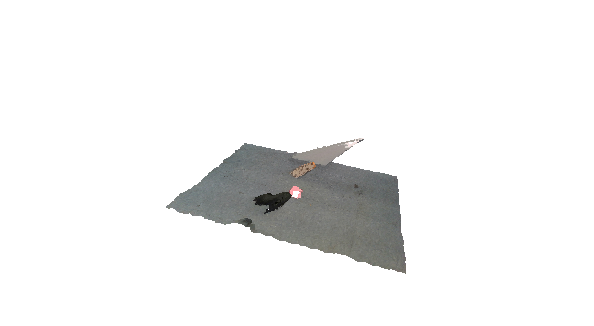

# README template
By Samuel Bloom, Zaraius Bilimoria

## Project Description
Takes the bag file from the camera and displays the data in Open3d.

Example output:


## Install Instructions
Make sure your numpy version is -> 1.26.4

```bash
pip install open3d
pip install --force-reinstall numpy==1.26.4
```

## Methodology
This is where you can do in-depth about how this repo works. Think of this section as writing a project report for a class.  
*Note: Markdown supports LaTex, so you can use it to embedd equations*  

$$a^2 + b^2 = c^2$$

## Troubleshooting (Optional)
If there are common errors that might occur when running your project, you can mention how to solve them here. 